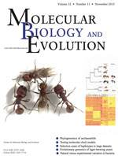

## Publications

Click on these icons for the paper  to download pdf, or  for media coverage.

* A. Barua,  **A.S. Mikheyev**. Many options, few solutions: Over 60 my snakes converged on a few optimal venom formulations. *in press*, 2019 

* A. Wallberg, I. Bunikis, O.V. Pettersson, M-B. Mosbech, A.K. Childers, J.D. Evans, **A.S Mikheyev**, H.M. Robertson, G.E. Robinson, M.T. Webster. A hybrid *de novo* genome assembly of the honeybee, *Apis mellifera*, with chromosome-length scaffolds. *BMC Genomics*, 20 , 275, 2019 

* M.R. Warner, L. Qiu, M.J Holmes, **A.S. Mikheyev**, T.A. Linksvayer. Convergent eusocial evolution is based on a shared reproductive groundplan plus lineage-specific plastic genes. *Nature Communications*. 10:2651, 2019

* M.R. Warner, **A.S. Mikheyev**, T.A. Linksvayer. Transcriptomic basis and evolution of the ant nurse-larval social interactome. *PLoS genetics* 15, e1008156, 2019 

* L. Holman, H. Helanterä, K. Trontti, **A.S. Mikheyev**. Comparative transcriptomics of social insect queen pheromones. 10:1, 1593, 2019 

* C. Morandin, V.P. Brendel, L. Sundström, H. Helanterä, **A.S. Mikheyev**. Changes in gene DNA methylation and expression networks accompany caste specialization and age‐related physiological changes in a social insect. *Molecular Ecology*, 28  1975-1993. 2019 

* C. Emborski, **A.S. Mikheyev**. Ancestral diet transgenerationally influences offspring in a parent-of-origin and sex-specific manner. *Philosophical Transactions of the Royal Society B* 374, 20180181 

* C.C. Smith, J.N. Weber, **A.S. Mikheyev**, F. Roces, M. Bollazzi, K. Kellner, J.N. Seal, U.G. Mueller. Landscape genomics of an obligate mutualism: Concordant and discordant population structures between the leafcutter ant *Atta texana* and its two main fungal symbiont types. *Molecular Ecology*. 28, 2831-2845, 2019 

* N. Jovanovic, **A.S. Mikheyev**. Interactive web-based visualization and sharing of phylogenetic trees using phylogeny.IO. *Nucleic Acids Research*  47:1, W266–W269,2019 

* K. Bozek, L. Hebert, **A.S. Mikheyev**, G.J. Stephens. Towards dense object tracking in a 2D honeybee hive. *The IEEE Conference on Computer Vision and Pattern Recognition (CVPR)*, pp4185-4193, 2018 

* U.G. Mueller _et al._ Biogeography of mutualistic fungi cultivated by leafcutter ants. *Molecular Ecology*. 26, 6921-6937, 2017 

* A.L. Carlson, H.D. Ishak, J. Kurian, **A.S. Mikheyev**, I. Gifford and U.G. Mueller.
Nuclear populations of the multinucleate fungus of leafcutter ants can be dekaryotized and recombined to manipulate growth of nutritive hyphal nodules harvested by the ants. *Mycologia* DOI: 10.1080/00275514.2017.1400304, 2017 

* **A. S. Mikheyev**, A. Zwick., M.J.L. Magrath, M.L. Grau, L. Qiu, Y.N. Su, D. Yeates.  Museum genomics confirms that the Lord Howe Island stick insect survived extinction, *Current Biology* 27, 3157-3161, 2017 31098-9.pdf) 

* J. Gospocic, E.J. Shields, K.M. Glastad, Y. Lin, C.A. Penick, H. Yan, **A.S. Mikheyev**, T.A. Linksvayer, B.A. Garcia, S.L. Berger, J. Liebig, D. Reinberg, R. Bonasio. The neuropeptide corazonin controls social behavior and caste identity in ants. *Cell* 170:4, 748-759, 2017 

* S.D. Aird, J. Arora, A. Barua, L. Qiu, K. Terada, and **A.S. Mikheyev**. Population genomic analysis of a pitviper reveals microevolutionary forces underlying venom chemistry, *Genome Biology and Evolution* 9:10, 2640-2649, 2017 

* S.D. Aird, N. Jorge da Silva, L. Qiu, A. Villar-Briones, V. Aparecida Saddi, M. Pires de Campos Telles, M. L. Grau, **A.S. Mikheyev**. Coralsnake venomics: Analyses of venom gland transcriptomes and proteomes of six Brazilian taxa, *Toxins* 9:6, E187, 2017 

* C. Morandin, **A.S. Mikheyev**, J.S. Pedersen, H Helanterä. Evolutionary constraints shape caste‐specific gene expression across 15 ant species, *Evolution* 71, 1273-1284, 2017 

* M.R. Warner, **A.S. Mikheyev**, T.A. Linksvayer, Genomic signature of kin selection in an ant with obligately sterile workers, *Molecular Biology and Evolution* 34:7, 1780-1787, 2017 

* S.D. Aird, A. Villar Briones, M.C. Roy, **A.S. Mikheyev**, Polyamines as snake toxins and their probable pharmacological functions in envenomation, *Toxins* 8:10, 279, 2016 

* Y. Okada, Y. Watanabe, M.M.Y. Tin, K. Tsuji, **A.S. Mikheyev**, Social dominance alters nutrition‐related gene expression immediately: transcriptomic evidence from a monomorphic queenless ant, *Molecular Ecology*, 26:11, 2922–2938, 2017 

* D.K. Yeates, A. Zwick, **A.S. Mikheyev**, Museums are biobanks: unlocking the genetic potential of the three billion specimens in the world's biological collections, *Current Opinion in Insect Science* 18, 83-88, 2016

* I. Morozova, P. Flegontov, **A.S. Mikheyev**, H. Asgharian, P. Ponomarenko, V. Klyuchnikov, G. ArunKumar, S. Bruskin, E. Prokhortchouk, Y. Gankin, E. Rogaev, Y. Nikolsky, A. Baranova, E. Elhaik, T.V. Tatarinova, Toward high-resolution population genomics using archaeological samples, *DNA Research* 23:4, 295–310, 2016 

* M. Helmkampf\*, **A.S. Mikheyev**\*, Y. Kang, J. Fewell and J. Gadau. Gene expression and variation in social aggression by queens of the harvester ant *Pogonomyrmex californicus*. *Molecular Ecology* 25(15):3716-30, 2016 
\*contributed equally

* A. Reyes-Bermudez, A. Villar-Briones, C Ramirez-Portilla, M Hidaka, **A.S. Mikheyev**. Developmental progression in the coral *Acropora digitifera* is controlled by differential expression of distinct regulatory gene networks. *Genome Biology and Evolution* 8:3, 851-870, 2016 

* C. Morandin, M.M.Y. Tin, S. Abril, C. Gómez, L. Pontieri, M. Schiøtt, L. Sundström, K. Tsuji, J.S. Pedersen, H. Helanterä, **A.S. Mikheyev**. Comparative transcriptomics reveals the conserved building blocks involved in parallel evolution of ant phenotypic traits. *Genome Biology* 17:43, 2016 

* Y. Mitaka, K. Kobayashi, **A.S. Mikheyev**, M.M.Y. Tin, Y. Watanabe, K Matsuura. Caste-specific and sex-specific expression of chemoreceptor genes in a termite *PloS ONE* 11(1):e0146125, 2016 

* M.O. Miyakawa and **A.S. Mikheyev**, QTL mapping of sex determination loci supports an ancient pathway in ants and honey bees. *PLoS Genetics* 11: e1005656, 2015

* G. Fischer, F.L. Azorsa, F.H. Garcia, **A.S. Mikheyev**, E.P. Economo. Two new phragmotic ant species from Africa: morphology and next-generation sequencing solve a caste association problem in the genus *Carebara* Westwood. *ZooKeys* 525: 77-105, 2015

* 

C.R. Smith S. Helms Cahan, C. Kemena, S.G. Brady, W. Yang, E. Bronberg-Bauer, T. Eriksson, J. Gadau, M. Helmkampf, D. Gotzek, M. O. Miyakawa, A.V. Suarez and **A.S. Mikheyev**, How do genomes create novel phenotypes? Insights from the loss of the worker caste in ant social parasites, *Molecular Biology and Evolution* 32: 2919-2931, 2015 

* **A.S. Mikheyev**, M.M.Y. Tin, J. Arora and T.D. Seeley, Museum samples reveal rapid evolution by wild honey bees exposed to a novel parasite, *Nature Communications* 6: 7991, 2015 

* S.D. Aird, S. Aggarwal, A. Villar-Briones, M.M.Y. Tin, K. Terada, and **A. S. Mikheyev**, Snake venoms are integrated systems, but abundant venom proteins evolve more rapidly. *BMC Genomics* 16:647, 2015 

* C. Parmesan, A. Williams-Anderson, M. Moskwik, **A.S. Mikheyev** and M.C. Singer. Endangered Quino checkerspot butterfly: A climate change success story? *Journal of Insect Conservation* 19:185-204, 2015. 

* M.M.Y. Tin, F.E. Rheindt, E. Cros and **A.S. Mikheyev**, Degenerate adaptor sequences for detecting PCR duplicates in reduced representation sequencing data improve genotype calling accuracy. *Molecular Ecology Resources*.* 15:2 329-336, 2015. 

* M.O. Miyakawa and **A.S. Mikheyev**. Males are here to stay: fertilization enhances viable egg production by clonal queens of the little fire ant (*Wasmannia auropunctata*). *The Science of Nature* 102:15, 2015. .pdf)

* **A.S. Mikheyev** and T. Linksvayer. Genes associated with ant social behavior show distinct transcriptional and evolutionary patterns. *eLife* 2015;10.7554/eLife.04775, 2015. 

* **A.S. Mikheyev** and M.M.Y. Tin. A first look at the Oxford Nanopore MinION sequencer. *Molecular Ecology Resources* 14: 1097–1102. 2014 

* O. Gusev, Y. Suetsugu, R. Cornette, T. Kawashima, M.D. Logacheva, A.S. Kondrashov, A.A. Penin, R.Hatanaka, S.Kikuta, S.Shimura, H. Kanamori, Y. Katayose, T. Matsumoto, E. Shagimardanova, D. Alexeev, V. Govorun, J. Wisecaver, **A.S. Mikheyev**, R. Koyanagi, M. Fujie, T. Nishiyama, S. Shigenobu, T. F. Shibata, V. Golygina, M. Hasebe, T. Okuda, N. Satoh, T. Kikawada. 2014. Comparative genome sequencing reveals genomic signature of extreme desiccation tolerance in the anhydrobiotic midge. *Nature Communications* 5:4784. 

* Tin M.M.-Y., Economo E.P., and  **A.S. Mikheyev**. Sequencing degraded DNA from non-destructively sampled museum specimens for RAD-tagging and low-coverage shotgun phylogenetics. *PLoS ONE* 9(5):e96793, 2014. 

* S.D. Aird, Y. Watanabe, A. Villar-Briones, M.C. Roy, K. Terada, and **A.S. Mikheyev**. Quantitative high-throughput profiling of snake venom gland transcriptomes and proteomes (*Ovophis okinavensis* and *Protobothrops avoviridis*). *BMC Genomics* 14:790, 2013.  .pdf)

* **A.S. Mikheyev**, C.S. McBride, U.G. Mueller, C. Parmesan, M.R. Smee, C. Stefanescu, B. Wee, and M.C. Singer. Host-associated genomic differentiation in congeneric butterflies: now you see it, now you do not. *Molecular Ecology* 22:4753-4766, 2013. 

* M.R. Smee, Y. Pauchet, P. Wilkinson, B. Wee, M.C. Singer, D.J. Hodgson, and **A.S. Mikheyev**. Microsatellites for the marsh fritillary butterfly: *De novo* transcriptome sequencing, and a comparison with amplified fragment length polymorphism (AFLP) markers. *PloS ONE* 8(1):e54721, 2013. %20Markers.pdf)

* U.G. Mueller, **A.S. Mikheyev** *et al*. Evolution of cold-tolerant fungal symbionts permits winter fungiculture by leafcutter ants at the northern frontier of a tropical ant-fungus symbiosis. *Proceedings of the National Academy of Sciences* 108(10):4053-4056, 2011. 

* U.G. Mueller, **A.S. Mikheyev**, S.E. Solomon, and M. Cooper. Frontier mutualism: coevolutionary patterns at the northern range limit of the leaf-cutter ant-fungus symbiosis. *Proceedings of the Royal Society B: Biological Sciences* 278(1721):3050-3059, 2011. 

* A.E. Dunham and **A.S. Mikheyev**. Influence of an invasive ant on grazing and detrital communities and nutrient fluxes in a tropical forest. *Diversity and Distributions* 16(1):33-42, 2010. 

* J. Foucaud, J. Orivel, A. Loiseau, J.H. Delabie, H. Jourdan, D. Konghouleux, M. Vonshak, M. Tindo, J.L. Mercier, D. Fresneau, and J.-B. Mikissa, T. McGlynn, **A.S. Mikheyev**, J. Oettler and A. Estoup. Worldwide invasion by the little fire ant: routes of introduction and eco-evolutionary pathways. *Evolutionary Applications* 3(4):363-374, 2010. 

* **A.S. Mikheyev**, U.G. Mueller, and P. Abbot. Comparative dating of attine ant and lepiotaceous cultivar phylogenies reveals coevolutionary synchrony and discord. *The American Naturalist* 175(6):E126-E133, 2010. 

* **A.S. Mikheyev**, T. Vo, B. Wee, M.C. Singer, and C. Parmesan. Rapid microsatellite isolation from a butterfly by *de novo* transcriptome sequencing: performance and a comparison with a AFLP-derived distances. *PLoS ONE* 5(6):e11212, 2010. 

* **A.S. Mikheyev**, S. Bresson, and P. Conant. Single-queen introductions characterize regional and local invasions by the facultatively clonal little fire ant *Wasmannia auropunctata*. *Molecular Ecology* 18(14):2937-2944, 2009. 

* T.L. Vo, U.G. Mueller, and **A.S. Mikheyev**. Free-living fungal symbionts (Lepiotaceae) of fungus-growing ants (Attini: Formicidae). *Mycologia* 101(2):206-210, 2009. %20of%20fungus-growing%20ants%20(Attini%20Formicidae).pdf)

* **A.S. Mikheyev**. History, genetics and pathology of a leaf-cutting ant introduction: a case study of the guadeloupe invasion. *Biological Invasions* 10(4):467-473, 2008. 

* **A.S. Mikheyev**, L. Tchingnoumba, A. Henderson, and A. Alonso. Effect of propagule pressure on the establishment and spread of the little fire ant *Wasmannia auropunctata* in a Gabonese oilfeld. *Diversity and Distributions* 14(2):301-306, 2008. 

* **A.S. Mikheyev**, T. Vo, and U.G. Mueller. Phylogeography of post-pleistocene population expansion in a fungus-gardening ant and its microbial mutualists. *Molecular Ecology* 17(20):4480-4488, 2008. 

* J. Martins, S. Solomon, **A.S. Mikheyev**, U. Mueller, A. Ortiz, and M. Bacci. Nuclear mitochondrial-like sequences in ants: evidence from *Atta cephalotes* (Formicidae: Attini). *Insect Molecular Biology* 16(6):777-784, 2007. .pdf)

* **A.S. Mikheyev** and U.G. Mueller. Genetic relationships between native and introduced populations of the little fire ant *Wasmannia auropunctata*. *Diversity and Distributions*13(5):573-579, 2007. 

* **A.S. Mikheyev**, U.G. Mueller, and J.J. Boomsma. Population genetic signatures of diffuse co-evolution between leaf-cutting ants and their cultivar fungi. *Molecular Ecology* 16(1):209-216, 2007. 

* **A.S. Mikheyev**, U.G. Mueller, and P. Abbot. Cryptic sex and many-to-one coevolution in the fungus-growing ant symbiosis. *Proceedings of the National Academy of Sciences* 103(28):10702-10706, 2006. 

* **A.S. Mikheyev** and U. Mueller. Invasive species: customs intercepts reveal what makes a good ant stowaway. *Current Biology* 16(4):R129-R131, 2006. 

* S.E. Solomon and **A.S. Mikheyev**. The ant (Hymenoptera: Formicidae) fauna of Cocos Island, Costa Rica. *Florida Entomologist* 88(4):415-423, 2005. 

* **A.S. Mikheyev**. Male accessory gland size and the evolutionary transition from single to multiple mating in the fungus-gardening ants. *Journal of Insect Science* 4, 2004. 

* **A.S. Mikheyev** and W. Tschinkel. Nest architecture of the ant *Formica pallidefulva*: structure, costs and rules of excavation. *Insectes Sociaux* 51(1):30-36, 2004. 

* **A.S. Mikheyev**. Evidence for mating plugs in the fire ant *Solenopsis invicta*. *Insectes Sociaux* 50(4):401-402, 2003. 

* T. Seeley and **A.S. Mikheyev**. Reproductive decisions by honey bee colonies: tuning investment in male production in relation to success in energy acquisition. *Insectes Sociaux* 50(2):134-138, 2003. 

* W.R. Tschinkel, **A.S. Mikheyev**, and S.R. Storz. Allometry of workers of the fire ant, *Solenopsis invicta*. *Journal of Insect Science* 3, 2003. 

* T.D. Seeley, **A.S. Mikheyev**, and G.J. Pagano. Dancing bees tune both duration and rate of waggle-run production in relation to nectar-source profitability. *Journal of Comparative Physiology A* 186(9):813-819, 2000. 
